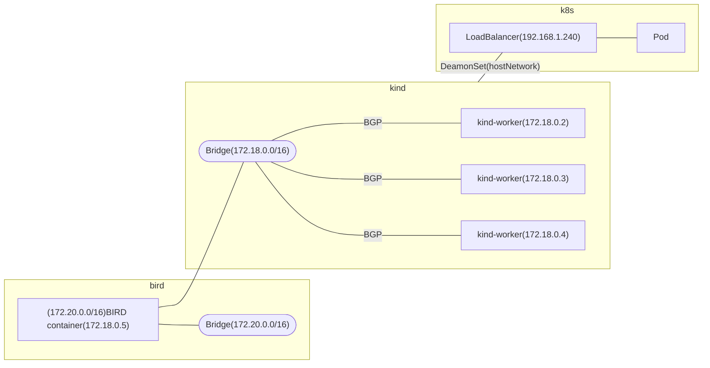

```mermaid
graph LR
subgraph bird
    A["(172.20.0.0/16)BIRD container(172.18.0.5)"]---Y(["Bridge(172.20.0.0/16)"])
end
    A---X(["Bridge(172.18.0.0/16)"])

subgraph kind
    X---|BGP|B["kind-worker(172.18.0.2)"]
    X---|BGP|C["kind-worker(172.18.0.3)"]
    X---|BGP|D["kind-worker(172.18.0.4)"]
end
subgraph k8s
    E["LoadBalancer(192.168.1.240)"]---F["Pod"]
end
kind---|"DeamonSet(hostNetwork)"|E
```
