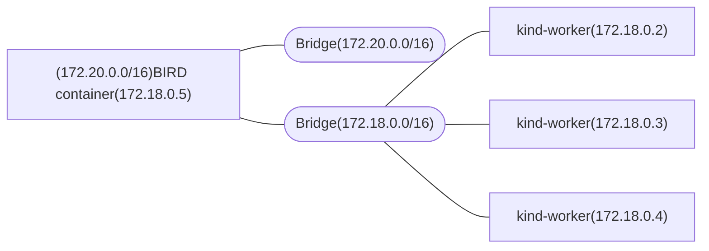

```mermaid
graph LR
A["(172.20.0.0/16)BIRD container(172.18.0.5)"]---Y(["Bridge(172.20.0.0/16)"])
A---X(["Bridge(172.18.0.0/16)"])
X---B["kind-worker(172.18.0.2)"]
X---C["kind-worker(172.18.0.3)"]
X---D["kind-worker(172.18.0.4)"]
```
